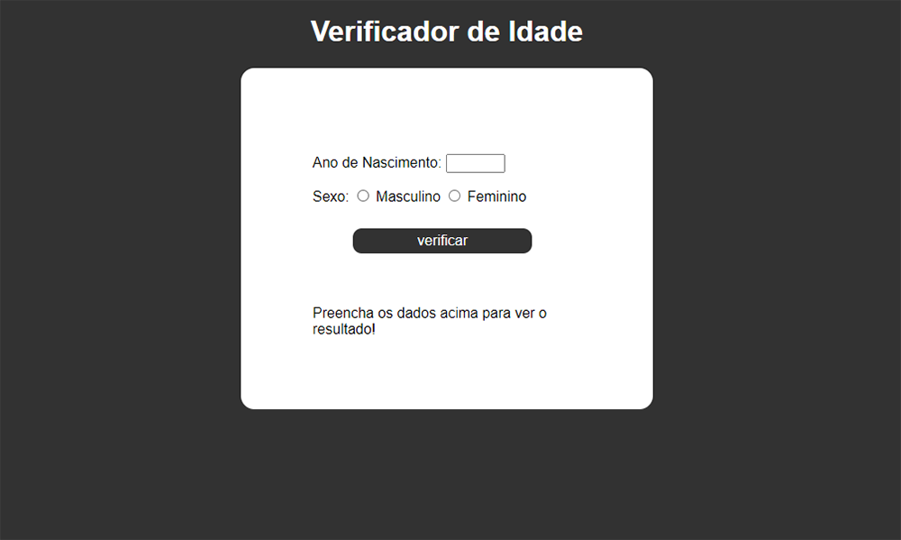

# Verificador de idade
Calcula a idade do usuário com base na data de nascimento e no ano atual. Também imprime uma miniatura
de um indivíduo com a idade aproximada resultante.

# Screenshots
<strong>Interface antes de inserir os dados:<strong>

<strong>Interface após inserir dados de um homem:<strong>

<strong> Interface após inserir dados de uma mulher:<strong>

### [🔗Clique aqui para acessar](https://tiagow-san.github.io/Verificador-de-idade/)

## 🛠 Tecnologias

- JavaScript
- HTML
- CSS
- Git e Github
